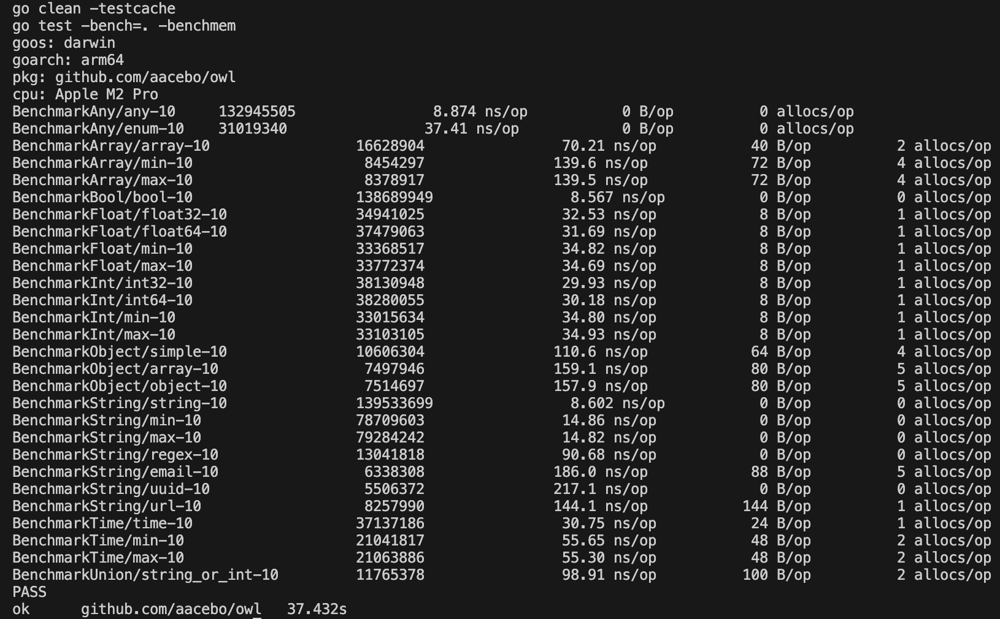

# Assert

a schema validator

# Usage

```go
schema := assert.String().Required()

if err := schema.Validate("..."); err != nil { // nil
	panic(err)
}
```

# Features

| Name			             | Status			   |
|----------------------------|---------------------|
| Any						 | ✅				  |
| Bool						 | ✅				  |
| Float						 | ✅				  |
| Int						 | ✅				  |
| String					 | ✅				  |
| Object					 | ✅				  |
| Array						 | ✅				  |
| Time						 | ✅				  |
| Union						 | ✅				  |
| Custom Error Messages      | ✅				  |
| Custom Rules				 | ✅				  |

# Benchmarks


